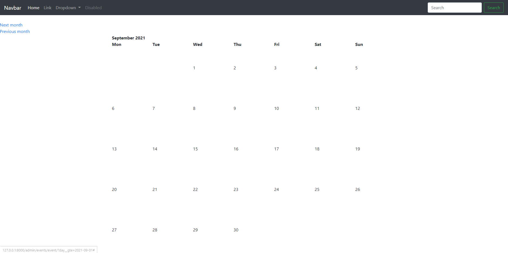

# djangoProject

This djangoProject is a project that creates a web application using Django web framework and Bootstrap to create a calendar.

# Usage/Installation
pip install -r requirements.txt  
python manage.py migrate  
python manage.py createsuperuser  
python manage.py runserver  
Copy and paste http:localhost:8000/admin in your url and sign in with your own admin credential.  

# Overview

